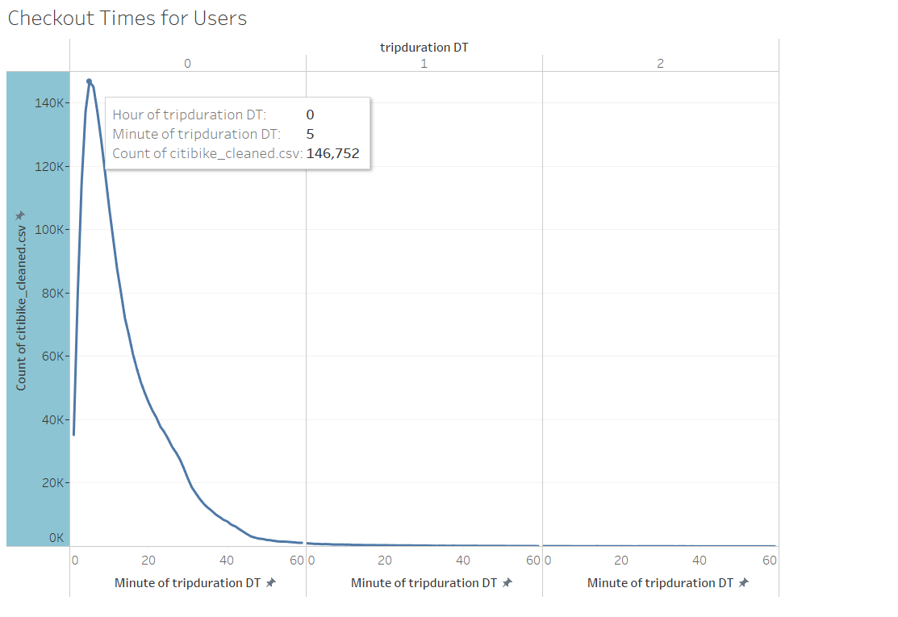
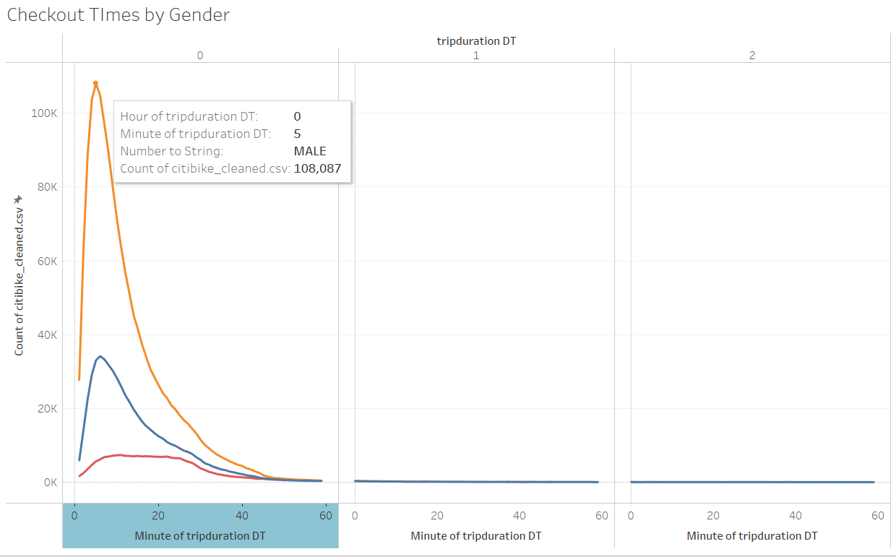
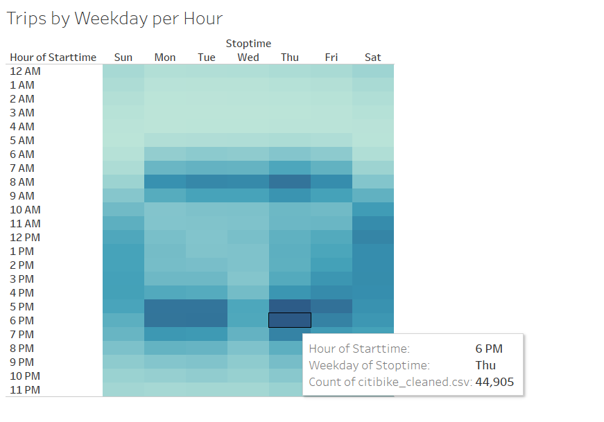
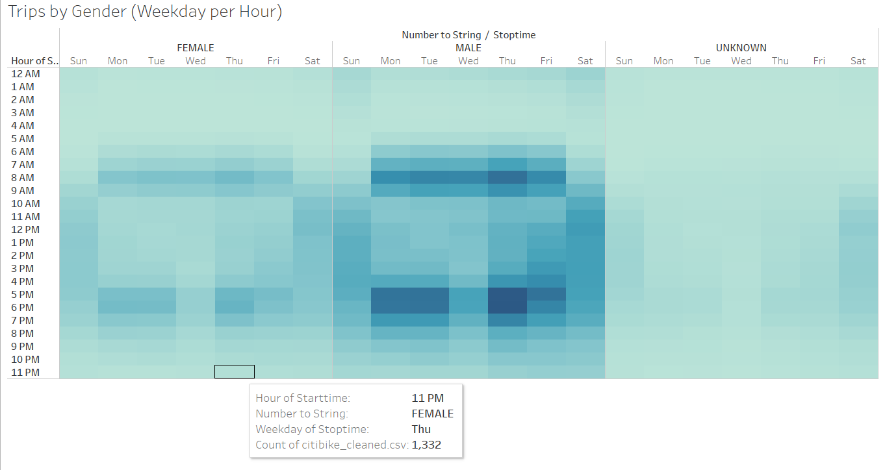
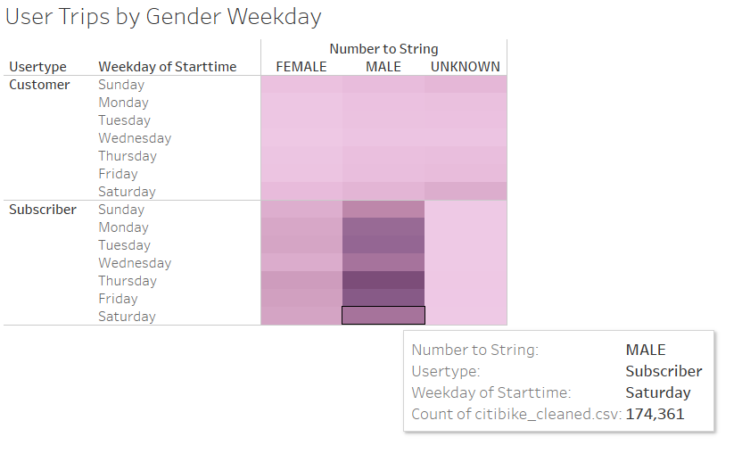
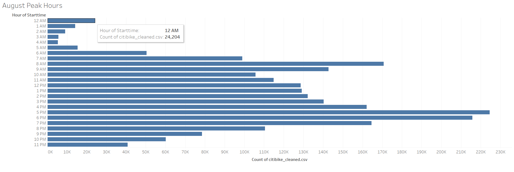
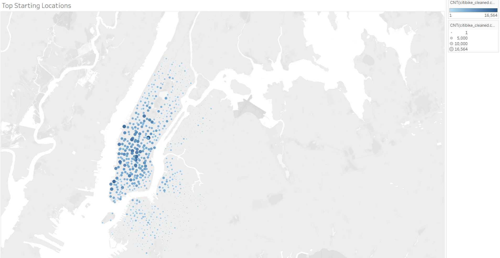

# bikesharing

## Overview:

#### The purpose of the analysis is to create a visualization using Tableau in order to present NYC bikesharing data.  To see the full Tableau visit the following link:
#### [Tableau NYC bikeshare](https://public.tableau.com/profile/paige.spiller#!/vizhome/Bikeshare_Challenge/NYCbikesharestory)

## Results:

### Checkout times:

#### The checkout times for users graph shows that the bikes checked out peak at minute five of the first hour.  Additionally, we note that most bikeshare trips are under an hour. 

### Times by gender:

#### The times by gender graph shows that the large majority of bikeshare customers are male, and the majority of bikeshare trips across all genders are under an hour. 

### Trips by weekday:

#### The trips by weekday graph shows that the times with the highest checkouts are between 6am - 9am and 5pm - 7pm on the weekdays and 10am - 4pm on Saturday.

### Trips by gender (weekday per hour)

#### The trips by gender graph shows that Males are the most likely to check a bike out between the hours of 5pm - 7pm.

### User trips by Gender (per weekday)

#### The user trips by gender shows that the majority of customers are Male and subscibers. 

### August peak hours

#### The August peak hours graph shows that the most popular hours are 4pm and 5pm. 

### Top starting locations

#### The top starting locations graph shows the most popular starting locations by size and color of the marker. 

## Summary:

#### In conclusion, we can easily visualize the data with Tableau to conclude that the majority of customers are Male subscribers that most often checkout bikes during standard work commute hours (6am - 9am and 5pm - 7pm on the weekdays).  Two additional visualizations that would be useful for this analysis would be a graph that shows 
